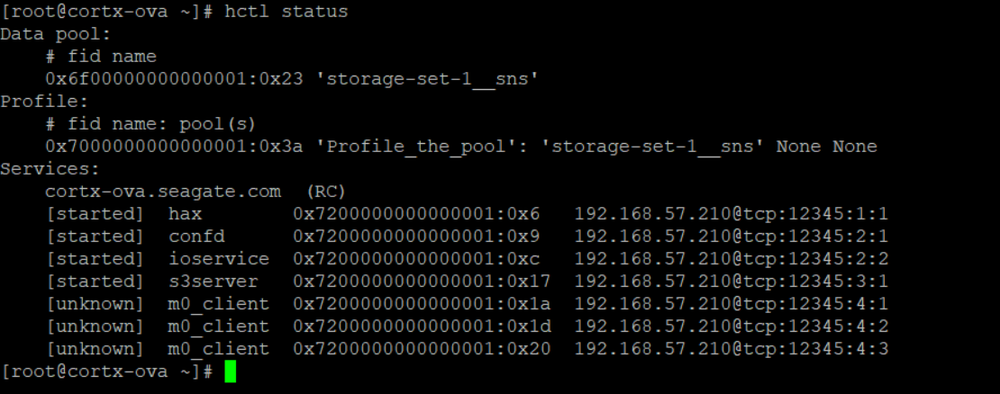

# Deploy Cortx Build Stack

This document provides step-by-step instructions to deploy the CORTX stack. After completing the steps provided in this document you can:

  - Deploy all the CORTX components
  - Create and run the CORTX cluster


## Prerequisite

- All the prerequisites specified in the [Setting up the CORTX Environment for Single Node]() must be satisfied.

- The CORTX packages must be generated using the steps provided in [Deploy Cortx Build Stack](https://github.com/Seagate/cortx/blob/main/doc/Release_Build_Creation.rst).

- Set repository URL

   ```
     export CORTX_RELEASE_REPO="file:///var/artifacts/0"
   ```

## Procedure

1. Set repository URL using the following command:

   ```
     export CORTX_RELEASE_REPO="file:///var/artifacts/0"   
   ```

2. Run the following command to install the provisioner APIs and required packages:

   ```
      yum install -y yum-utils
      yum-config-manager --add-repo "${CORTX_RELEASE_REPO}/3rd_party/"
      yum-config-manager --add-repo "${CORTX_RELEASE_REPO}/cortx_iso/"

      cat <<EOF >/etc/pip.conf
      [global]
      timeout: 60
      index-url: $CORTX_RELEASE_REPO/python_deps/
      trusted-host: $(echo $CORTX_RELEASE_REPO | awk -F '/' '{print $3}')
      EOF

      # Cortx Pre-requisites
      yum install --nogpgcheck -y java-1.8.0-openjdk-headless
      yum install --nogpgcheck -y python3 cortx-prereq sshpass

      # Pre-reqs for Provisioner
      yum install --nogpgcheck -y python36-m2crypto salt salt-master salt-minion

      # Provisioner API
      yum install --nogpgcheck -y python36-cortx-prvsnr

      # Verify provisioner version (0.36.0 and above)
      provisioner --version
   ```

3. Run the following commands to clean the temporary repos:

   ```
      rm -rf /etc/yum.repos.d/*3rd_party*.repo
      rm -rf /etc/yum.repos.d/*cortx_iso*.repo
      yum clean all
      rm -rf /var/cache/yum/
      rm -rf /etc/pip.conf
   ```

4. Create the config.ini file:

     **Note:** The config.ini file requires you to add the metadata disk, data disk, and NICs, information. Run the following command to find the devices on your node:

    ```
      device_list=$(lsblk -nd -o NAME -e 11|grep -v sda|sed 's|sd|/dev/sd|g'|paste -s -d, -)
    ```

   A. To find the metadata disks value for storage.cvg.0.metadata_devices, run:

     ```  
        echo ${device_list%%,*}
     ```

   B. To find the data disks value for storage.cvg.0.data_devices, run:

      ```
        echo ${device_list#*,}
      ```

   C. To find the interfaces as per zones defined in your VM, run:

      ```
        firewall-cmd --get-active-zones
      ```

   D. Run the following command to create configu,ini file:

      ```
        vi ~/config.ini
      ```

  E. Paste the code below in to the config file replacing your network interface names with ens33,ens34, ens35, and storage disks with /dev/sdb,../dev/sdc:

     ```
         [srvnode_default]
         network.data.private_interfaces=ens35
         network.data.public_interfaces=ens34
         network.mgmt.interfaces=ens33
         bmc.user=None
         bmc.secret=None

         storage.cvg.0.data_devices=/dev/sdc
         storage.cvg.0.metadata_devices=/dev/sdb
         network.data.private_ip=None

         [srvnode-1]
         hostname=deploy-test.cortx.com
         roles=primary,openldap_server

         [enclosure_default]
         type=other

         [enclosure-1]
     ```

5. To run the bootstrap Node:

   ```
      provisioner setup_provisioner srvnode-1:$(hostname -f) \
      --logfile --logfile-filename /var/log/seagate/provisioner/setup.log --source rpm \
      --config-path ~/config.ini --dist-type bundle --target-build ${CORTX_RELEASE_REPO}
   ```

6. Prepare the pillar data from the config.ini into Salt pillar, then export the pillar data to provisioner_cluster.json using following commands:

   ```
      provisioner configure_setup ./config.ini 1
      salt-call state.apply components.system.config.pillar_encrypt
      provisioner confstore_export
   ```

7. Configure the system and 3rd-Party Softwares:

   A. To configure the system components, run:

     ```
        provisioner deploy_vm --setup-type single --states system
     ```

   B. To configure third-party components, run:

     ```
       provisioner deploy_vm --setup-type single --states prereq
     ```

8. Configure the utils, IO path, and control path:

   A. To configure the CORTX utils components, run:

     ```
       provisioner deploy_vm --setup-type single --states utils
     ```

   B. To configure the CORTX IO path components, run:

     ```
       provisioner deploy_vm --setup-type single --states iopath
     ```

   C. To configure CORTX control path components, run:

     ```
       provisioner deploy_vm --setup-type single --states controlpath
     ```

9. To configure CORTX HA components:

   ```
     provisioner deploy_vm --setup-type single --states ha
   ```

10. Run the following command to start the CORTX cluster:

   ```
    cortx cluster start
   ```

11. Run the following commands to verify the CORTX cluster status:

   ```
      hctl status
   ```
   

12. Run the following commands to disable and stop the firewall:

    ```
      systemctl disable firewalld
      systemctl stop firewalld
    ```

13. After the CORTX cluster is up and running, configure the [CORTX GUI guide](https://github.com/Seagate/cortx/blob/main/doc/Preboarding_and_Onboarding.rst).

14. Create the S3 account and perform the IO operations using the instruction provided in [IO operation in CORTX](https://github.com/Seagate/cortx/blob/main/doc/testing_io.rst).


### Tested by:

- May 24 2021: Mukul Malhotra (mukul.malhotra@seagate.com) on a Windows laptop running VMWare Workstation 16 Pro.
- May 12, 2021: Christina Ku (christina.ku@seagate.com) on VM "LDRr2 - CentOS 7.8-20210511-221524" with 2 disks.
- Jan 6, 2021: Patrick Hession (patrick.hession@seagate.com) on a Windows laptop running VMWare Workstation 16 Pro.
